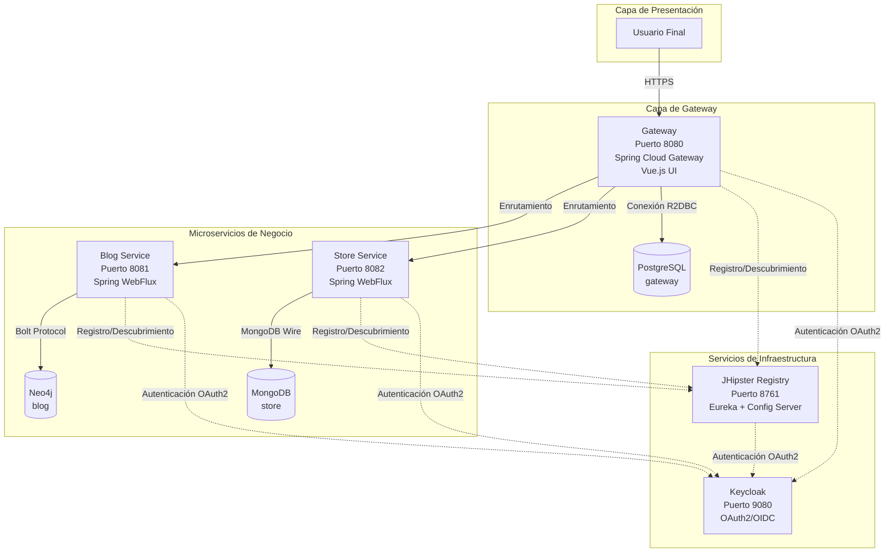

# Documento AS-IS: 2WQ-000 - JCDemo

---

## 1. Descripción

### 1.1 Resumen del proyecto
**Código de proyecto**: 2WQ-000

**Nombre del proyecto**: JCDemo

**Descripción del proyecto**:
JCDemo es un proyecto de demostración de arquitectura de microservicios reactivos construido con tecnologías empresariales modernas. El proyecto ilustra patrones y mejores prácticas para construir aplicaciones en la nube utilizando Java y Spring Framework. Sirve como ejemplo de referencia para implementaciones de microservicios con las siguientes características clave:

- Arquitectura basada en microservicios que separa las funcionalidades en servicios independientes
- Sistema de gestión de contenido tipo blog para crear y publicar artículos
- Catálogo de productos con gestión de inventario
- Portal web unificado que permite a los usuarios acceder a todas las funcionalidades
- Autenticación y autorización centralizadas para garantizar la seguridad
- Capacidad de despliegue en contenedores Docker y orquestación con Kubernetes

**Tecnologías principales utilizadas:**
- Java 11 - Lenguaje de programación principal
- JHipster 7.0.1 - Plataforma de desarrollo para generar aplicaciones Spring Boot + Angular/React/Vue
- Spring Boot 2.4.4 - Framework para crear aplicaciones Java empresariales
- Spring Cloud - Herramientas para sistemas distribuidos y microservicios
- Spring WebFlux - Soporte para programación reactiva no bloqueante
- PostgreSQL, MongoDB, Neo4j - Bases de datos para diferentes tipos de almacenamiento
- Keycloak - Solución de gestión de identidad y acceso
- Eureka - Servidor de descubrimiento de servicios
- Docker y Kubernetes - Plataformas de contenedorización y orquestación

### 1.2 Funcionalidades principales

El sistema proporciona las siguientes funcionalidades principales organizadas por componente:

**Gestión de Blog:**
- Crear, editar y eliminar blogs con nombre y identificador único
- Publicar artículos en los blogs con título, contenido y fecha de publicación
- Organizar artículos mediante etiquetas (tags) para facilitar la búsqueda y categorización
- Asociar múltiples etiquetas a cada artículo
- Navegar artículos mediante desplazamiento infinito

**Catálogo de Productos:**
- Registrar productos con título, precio e imagen
- Consultar listados de productos con paginación
- Visualizar detalles completos de cada producto
- Gestionar inventario de productos

**Portal Web Unificado:**
- Acceso centralizado a todas las funcionalidades del sistema
- Interfaz de usuario moderna construida con Vue.js
- Inicio de sesión único (Single Sign-On) mediante OAuth2/OIDC
- Gestión de usuarios y perfiles
- Navegación entre los diferentes módulos del sistema

**Servicios de Plataforma:**
- Registro y descubrimiento automático de servicios
- Configuración centralizada para todos los microservicios
- Monitorización y métricas de salud de los servicios
- Gestión de identidades y control de acceso basado en roles

### 1.3 Usuarios

| Usuario o sistema | Descripción del uso general que el usuario da al sistema o las interacciones importantes de este |
|------------|---------|
| Usuarios finales / Consumidores | Acceden al portal web para navegar el catálogo de productos, leer artículos del blog y consultar contenido publicado. |
| Creadores de contenido / Editores | Utilizan el sistema para crear y publicar artículos en blogs, gestionar etiquetas y organizar el contenido. |
| Administradores de productos | Gestionan el catálogo de productos, añadiendo nuevos artículos, actualizando precios e imágenes. |
| Administradores del sistema | Supervisan la salud de los microservicios, gestionan usuarios y roles, y consultan métricas de rendimiento a través del JHipster Registry. |
| Servicios externos | Otros sistemas pueden integrarse mediante las APIs expuestas por los microservicios para consumir datos de productos o blog. |

---

## 2. Arquitectura técnica

### 2.1 Diseño de la solución

El sistema está compuesto por los siguientes componentes principales:

| Componente | Descripción | 
|------------|---------|
| Gateway (Puerto 8080) | Punto de entrada principal al sistema. Proporciona la interfaz de usuario web desarrollada con Vue.js y enruta las peticiones a los microservicios correspondientes. Utiliza Java 11, Spring Boot 2.4.4, Spring Cloud Gateway para programación reactiva. Se conecta a una base de datos PostgreSQL 13.2 para almacenar información de usuarios y autorizaciones. Expone APIs REST para acceder a las funcionalidades de todos los microservicios. Implementa autenticación OAuth2 mediante Keycloak. |
| Blog Service (Puerto 8081) | Microservicio que gestiona toda la funcionalidad relacionada con blogs, artículos y etiquetas. Desarrollado con Java 11, Spring Boot 2.4.4 y Spring WebFlux para procesamiento reactivo. Utiliza Neo4j 4.2.4 como base de datos orientada a grafos para almacenar la estructura de blogs, posts y sus relaciones con tags. Se registra automáticamente en Eureka para descubrimiento de servicios. Implementa autenticación OAuth2 para comunicación segura entre servicios. |
| Store Service (Puerto 8082) | Microservicio responsable del catálogo de productos. Construido con Java 11, Spring Boot 2.4.4 y Spring WebFlux. Utiliza MongoDB 4.4.4 como base de datos NoSQL para almacenar productos con título, precio e imagen. Configurado para ejecutarse en modo cluster con replicación de base de datos. Expone APIs REST para operaciones CRUD sobre productos con soporte de paginación. |
| JHipster Registry (Puerto 8761) | Servidor de registro y configuración centralizada basado en Netflix Eureka y Spring Cloud Config. Versión 6.7.1. Proporciona descubrimiento de servicios permitiendo que los microservicios se encuentren entre sí dinámicamente. Gestiona configuración centralizada leyendo archivos de configuración compartidos. Ofrece panel de administración para monitorizar el estado de todos los servicios registrados. Implementa autenticación OAuth2 para acceso seguro. |
| Keycloak (Puerto 9080) | Servidor de gestión de identidad y acceso (IAM). Versión 12.0.4. Proporciona autenticación mediante OAuth2/OpenID Connect. Gestiona usuarios, roles y grupos. Implementa Single Sign-On (SSO) para todos los componentes del sistema. Utiliza el realm "jhipster" con usuarios y aplicaciones preconfiguradas. |

**Diagrama de arquitectura**:

### 2.2 Requisitos principales

 

**DATOS**
| Tipo de requerimiento | Descripción del requerimiento | 
|------------|---------|
| Clasificación de datos | **Sensitive** - El sistema maneja datos de usuarios, credenciales y contenido que pueden considerarse de uso interno. Los datos de productos y artículos de blog pueden ser públicos o de uso interno dependiendo de la configuración. | 
| Tiempo de datos | **Indefinido** - Los datos de blogs, artículos, productos y usuarios deben conservarse indefinidamente a menos que sean eliminados explícitamente por los administradores. El sistema está diseñado como entorno de demostración pero soporta retención a largo plazo. | 
| Protección de datos | Los datos se protegen mediante: **Autenticación OAuth2/OIDC** - Todas las peticiones requieren tokens válidos emitidos por Keycloak. **Comunicación entre servicios** - Autenticación mediante tokens OAuth2 para comunicación service-to-service. **Almacenamiento** - Las credenciales de bases de datos se gestionan mediante variables de entorno y configuración centralizada. Los secretos JWT están codificados en Base64 y deberían rotarse en producción. **Sin encriptación de datos en reposo** - Las bases de datos no implementan encriptación transparente por defecto. | 

 
 

**SEGURIDAD**
| Tipo de requerimiento | Descripción del requerimiento | 
|------------|---------|
| Autenticación | **Fuente**: Usuarios gestionados por Keycloak (puede integrarse con directorios corporativos). **Proveedor de Identidad (IdP)**: Keycloak como servidor de autorización OAuth2/OpenID Connect. **Tipo de credenciales**: Autenticación basada en formularios HTTPS con redirección OAuth2. **Protocolos**: OAuth2, OpenID Connect (OIDC), JWT (JSON Web Tokens). **Configuración**: Issuer URI apunta a `http://keycloak:9080/auth/realms/jhipster`. Múltiples clientes configurados: `web_app` para Gateway, `internal` para microservicios, `jhipster-registry` para el registro. | 
| Autorización | **Control de acceso basado en roles (RBAC)** - Keycloak gestiona roles `ROLE_ADMIN` y `ROLE_USER`. Los tokens JWT incluyen claims de `groups` que identifican los roles del usuario. Cada microservicio valida tokens y verifica roles antes de permitir operaciones. El Gateway filtra peticiones y aplica políticas de seguridad antes de enrutar a microservicios. | 
| Conectividad | **Red corporativa**: No hay información de conectividad con redes corporativas en la configuración actual. El sistema está diseñado para ejecutarse en entornos contenedorizados (Docker/Kubernetes). **Internet - Entrada**: El Gateway expone puerto 8080 para acceso HTTP desde clientes externos. En producción debería configurarse con HTTPS y certificados válidos. **Internet - Salida**: No hay evidencia de conexiones salientes a servicios externos de Internet. Todas las comunicaciones son internas entre los componentes del sistema. | 

 
 

**OPERACIÓN / MONITORIZACIÓN**
| Tipo de requerimiento | Descripción del requerimiento | 
|------------|---------|
| Estrategia de monitorización | **Herramientas**: JHipster Registry proporciona panel de control para visualizar estado de servicios. Spring Boot Actuator expone endpoints `/health` y `/metrics` en todos los microservicios. Prometheus está habilitado para exportación de métricas (`MANAGEMENT_METRICS_EXPORT_PROMETHEUS_ENABLED=true`). **KPIs monitorizados**: Registro y descubrimiento de servicios en Eureka. Estado de salud (health checks) de cada microservicio. Métricas de rendimiento exportadas a Prometheus. **Logs**: Nivel de logs configurable por perfil (DEBUG en desarrollo). No hay agregación centralizada de logs configurada. |
| SLA | No hay información suficiente sobre acuerdos de nivel de servicio. El sistema es una demostración y no tiene SLAs definidos. |
| Disaster Recovery | No hay información suficiente sobre estrategia de disaster recovery. La configuración de MongoDB en cluster con 3 réplicas (`dbPeerCount: 3`) proporciona redundancia básica para el servicio Store. |

 
 

**DEVOPS**
| Tipo de requerimiento | Descripción del requerimiento | Detalle | 
|------------|---------|---|
| Petición On-Boarding (SIAYA) | No hay información suficiente sobre este dato | Este es un proyecto de demostración sin onboarding formal | 
| Componente - Gateway | gateway | Repositorio origen: Bitbucket (mcp/bitbucket/2WQ-000/jhipster-k8s/gateway) | 
| Componente - Blog Service | blog | Repositorio origen: Bitbucket (mcp/bitbucket/2WQ-000/jhipster-k8s/blog) | 
| Componente - Store Service | store | Repositorio origen: Bitbucket (mcp/bitbucket/2WQ-000/jhipster-k8s/store) | 
| Uso de Tests Automatizados | **Gateway**: Tests E2E con Cypress, tests unitarios con JUnit. **Blog y Store**: Tests unitarios con JUnit, tests de integración (`integrationTest`). Todos los microservicios incluyen tasks Gradle para ejecutar tests (`backend:unit:test`). Checkstyle configurado para validación de estilo de código. Tests de documentación Javadoc (`backend:doc:test`). | Comandos disponibles en package.json y build.gradle |
| No Code (Kafka / Couch / Alertas) | No se utiliza Kafka, CouchDB ni sistemas de alertas no-code | El sistema usa comunicación HTTP/REST síncrona entre servicios |
| Entornos / Plataformas de despliegue | **Docker Compose**: Configuración completa para despliegue local en `docker-compose/docker-compose.yml`. **Kubernetes**: Descriptores de despliegue generados con JHipster en la carpeta `k8s/`. Namespace configurado: `demo`. Soporte para Minikube (local) y Google Kubernetes Engine (GKE). **Perfiles disponibles**: `dev` (desarrollo) y `prod` (producción). | Comandos de build incluyen jib para generar imágenes Docker |

 
 

**REQUISITOS TECNICOS**
| Tipo de requerimiento | Descripción del requerimiento | 
|------------|---------|
| Arquitectura | **Patrón de arquitectura**: Microservicios reactivos con Spring WebFlux. **Gateway Pattern**: Spring Cloud Gateway como punto de entrada único. **Service Discovery**: Netflix Eureka para registro dinámico de servicios. **Configuration Management**: Spring Cloud Config para configuración centralizada. **Database per Service**: Cada microservicio tiene su propia base de datos independiente. |
| Lenguaje y librerías | **Java 11** como lenguaje principal (especificación 1.8 a 15 soportada). **JHipster Dependencies 7.0.1** - Suite completa de librerías. **Spring Boot 2.4.4** - Framework base. **Hibernate 5.4.29.Final** - ORM (solo para Gateway con PostgreSQL). **MapStruct 1.4.2.Final** - Mapeo de objetos. **Gradle** como herramienta de build. **Node.js/npm** para gestión de dependencias frontend. Todas las librerías son open-source y ampliamente utilizadas en el ecosistema Java/Spring. |  
| Configuración | **Configuración externalizada**: Variables de entorno para credenciales y URLs de servicios. **Spring Cloud Config**: Configuración centralizada servida por JHipster Registry desde archivos YAML en `central-server-config/`. **Perfiles Spring**: Separación entre `dev` (desarrollo) y `prod` (producción). **Configuración por componente**: Cada microservicio puede sobrescribir configuración desde Config Server. **Secrets**: Los secretos JWT están codificados en Base64 en configuración. En producción deberían gestionarse mediante soluciones seguras (Kubernetes Secrets, Azure Key Vault, etc.). |
| Despliegue | **Containerización**: Docker con imágenes construidas mediante Google Jib (`jibDockerBuild`, `jibDockerPush`). **Orquestación**: Kubernetes con soporte para diferentes proveedores cloud. **CI/CD**: Scripts npm definidos para empaquetado (`ci:server:package`), preparación de tests E2E (`ci:e2e:prepare`), ejecución de tests backend (`ci:backend:test`). **Registro de imágenes**: Docker Hub configurado como registro por defecto (`dockerRepositoryName: mraible`). **Despliegue local**: Docker Compose para desarrollo y pruebas locales. |

### 2.3 Servicios y Jobs

| Entorno | Namespace | Componentes | Tipo | Réplicas  | Talla  | Quota Máxima Namespace  |  
|------------|---------|---|---|---|---|---|
| Docker Compose (desarrollo local) | N/A | gateway | Deployment | 1 | Memoria: 512MB máx, 256MB inicial | N/A | 
| Docker Compose (desarrollo local) | N/A | blog | Deployment | 1 | Memoria: 512MB máx, 256MB inicial | N/A |
| Docker Compose (desarrollo local) | N/A | store | Deployment | 1 | Memoria: 512MB máx, 256MB inicial | N/A |
| Docker Compose (desarrollo local) | N/A | jhipster-registry | Deployment | 1 | Memoria: 512MB máx, 256MB inicial | N/A |
| Kubernetes | demo | gateway | Deployment | No especificado | No especificado | No especificado |
| Kubernetes | demo | blog | Deployment | No especificado | No especificado | No especificado |
| Kubernetes | demo | store | Deployment | No especificado (cluster DB con 3 réplicas) | No especificado | No especificado |
| Kubernetes | demo | jhipster-registry | Deployment | No especificado | No especificado | No especificado |

**Nota**: La configuración específica de réplicas, tallas y quotas para Kubernetes se genera dinámicamente mediante JHipster K8s sub-generator y puede personalizarse durante el proceso de generación.

### 2.4 Matriz de comunicación

**MATRIZ DE COMUNICACIONES CON SISTEMAS EXTERNOS**
| Origen | Destino | FQDN/IP Destino | Protocolo L7 | Puerto  | Autenticación  | Propósito  | 
|------------|---------|---|---|---|---|--|
| Gateway | JHipster Registry | jhipster-registry:8761 (Docker) | HTTP | 8761 | Basic Auth (admin/password) | Registro de servicio y obtención de configuración centralizada |
| Gateway | Keycloak | keycloak:9080 (Docker) | HTTP | 9080 | OAuth2 Client Credentials | Validación de tokens OAuth2 y obtención de información de usuarios |
| Gateway | PostgreSQL | gateway-postgresql:5432 (Docker) | JDBC / R2DBC | 5432 | Usuario/contraseña (trust auth) | Almacenamiento de datos de usuarios y entidades del gateway |
| Blog Service | JHipster Registry | jhipster-registry:8761 (Docker) | HTTP | 8761 | Basic Auth (admin/password) | Registro de servicio y obtención de configuración centralizada |
| Blog Service | Keycloak | keycloak:9080 (Docker) | HTTP | 9080 | OAuth2 Client Credentials | Validación de tokens OAuth2 para autenticación inter-servicios |
| Blog Service | Neo4j | blog-neo4j:7687 (Docker) | Bolt | 7687 | Sin autenticación (NEO4J_AUTH=none) | Almacenamiento de blogs, posts y tags en base de datos de grafos |
| Store Service | JHipster Registry | jhipster-registry:8761 (Docker) | HTTP | 8761 | Basic Auth (admin/password) | Registro de servicio y obtención de configuración centralizada |
| Store Service | Keycloak | keycloak:9080 (Docker) | HTTP | 9080 | OAuth2 Client Credentials | Validación de tokens OAuth2 para autenticación inter-servicios |
| Store Service | MongoDB | store-mongodb:27017 (Docker) | MongoDB Wire Protocol | 27017 | Sin autenticación | Almacenamiento de productos en base de datos NoSQL |
| JHipster Registry | Keycloak | keycloak:9080 (Docker) | HTTP | 9080 | OAuth2 Client Credentials | Autenticación de acceso al panel de administración |
| Usuarios/Clientes | Gateway | localhost:8080 (desarrollo) / LoadBalancer (k8s) | HTTP/HTTPS | 8080 | OAuth2 Authorization Code Flow | Acceso a la interfaz web y APIs del sistema |

**Nota**: Los FQDN mostrados corresponden al entorno Docker Compose. En Kubernetes, los nombres de servicio siguen el patrón `<service-name>.<namespace>.svc.cluster.local`.

### 2.5 APIs y consumidores

| WSO API Name | Contexto | Versiones desplegadas | Gateways | Microservicio  | Endpoint  | 
|------------|---------|---|---|---|---|
| No hay información suficiente sobre este dato | Los microservicios exponen APIs REST pero no están registrados en WSO2 API Manager | N/A | N/A | N/A | N/A |

**APIs internas expuestas por los microservicios:**

**Gateway APIs:**
- `/api/account` - Gestión de cuenta de usuario
- `/api/authenticate` - Autenticación
- `/api/admin/users` - Administración de usuarios (solo ROLE_ADMIN)
- `/api/logout` - Cierre de sesión
- `/services/blog/**` - Proxy a Blog Service
- `/services/store/**` - Proxy a Store Service

**Blog Service APIs (a través de Gateway):**
- `/api/blogs` - CRUD de blogs
- `/api/posts` - CRUD de artículos
- `/api/tags` - CRUD de etiquetas

**Store Service APIs (a través de Gateway):**
- `/api/products` - CRUD de productos con paginación

**Detalle de los consumidores**

No hay información suficiente sobre consumidores externos. El sistema está diseñado como aplicación autónoma donde:
- El Gateway consume APIs de Blog Service y Store Service
- Los usuarios finales acceden al sistema solo a través del Gateway
- No hay evidencia de integraciones con sistemas externos o suscriptores de APIs

### 2.6 Comunicaciones asíncronas

**TÓPICOS DE KAFKA CONSUMIDORES**
| Servicio | Nombre | 
|------------|---------|
| No se utiliza Kafka | El sistema no implementa comunicación mediante mensajería Kafka | 

**TÓPICOS DE KAFKA PRODUCTORES**
| Servicio | Nombre | 
|------------|---------|
| No se utiliza Kafka | El sistema no implementa comunicación mediante mensajería Kafka | 

**Nota**: El sistema utiliza exclusivamente comunicación síncrona mediante APIs REST HTTP/HTTPS entre sus componentes. No se han encontrado configuraciones de brokers de mensajería como Kafka, RabbitMQ o ActiveMQ en los archivos de configuración.

### 2.7 Bases de datos

 
 

**BASE DE DATOS**
| Componente | Base de Datos | URL/Dirección completa | Tipo       | Entorno(s) | Propósito | Tablas/Colecciones | Notas (TTL e índices) |
|-------------|---------------|---------------|------------|------------|-----------|---------------------|--------|
| Gateway | PostgreSQL 13.2 | r2dbc:postgresql://gateway-postgresql:5432/gateway (R2DBC) y jdbc:postgresql://gateway-postgresql:5432/gateway (Liquibase) | Relacional | Docker Compose, Kubernetes | Almacenamiento de usuarios, autoridades y datos del gateway | Tablas gestionadas por Liquibase: users, authorities, user_authority, databasechangelog, databasechangeloglock | No hay TTL configurado. Índices gestionados automáticamente por JHipster/Liquibase |
| Gateway | H2 (en memoria) | En memoria | Relacional | Desarrollo (dev profile) | Base de datos embebida para desarrollo rápido sin instalación | Similar a PostgreSQL pero en memoria | Los datos se pierden al reiniciar |
| Blog Service | Neo4j 4.2.4 | bolt://blog-neo4j:7687 | Base de datos de grafos (NoSQL) | Docker Compose, Kubernetes | Almacenamiento de blogs, posts, tags y sus relaciones | Nodos: Blog (name, handle), Post (title, content, date), Tag (name), User (login). Relaciones: User-[:HAS_BLOG]->Blog, Blog-[:HAS_POST]->Post, Post-[:HAS_TAG]->Tag | No hay TTL configurado. Sin autenticación (NEO4J_AUTH=none en desarrollo). En producción debería configurarse autenticación |
| Store Service | MongoDB 4.4.4 | mongodb://store-mongodb:27017/?waitQueueMultiple=1000 con database: store | NoSQL Documental | Docker Compose, Kubernetes | Almacenamiento de productos | Colección: product (documentos con campos: title, price, image, imageContentType) | No hay TTL configurado. Configurado para ejecutarse en modo cluster con 3 réplicas (dbPeerCount: 3) en Kubernetes |
| Keycloak | H2 (embebida) | Embebida en Keycloak | Relacional | Docker Compose, Kubernetes | Almacenamiento de usuarios, roles, clientes OAuth2 y configuración de Keycloak | Tablas internas de Keycloak (no expuestas directamente) | Configuración de demostración. En producción debería usar PostgreSQL o MySQL |

---

## 3. Información adicional

### Desafíos o problemas actuales

**Aspectos de seguridad:**
- Los secretos JWT están codificados en Base64 en archivos de configuración en texto plano. En un entorno de producción estos deberían gestionarse mediante sistemas de gestión de secretos (Kubernetes Secrets, HashiCorp Vault, Azure Key Vault).
- Neo4j configurado sin autenticación (`NEO4J_AUTH=none`) en la configuración de desarrollo. Esto debe habilitarse en producción.
- PostgreSQL configurado con `POSTGRES_HOST_AUTH_METHOD=trust` que permite conexiones sin contraseña. Debe configurarse autenticación adecuada en producción.
- Las comunicaciones entre servicios usan HTTP en lugar de HTTPS. En producción debería implementarse TLS/SSL.

**Escalabilidad y alta disponibilidad:**
- Solo el Store Service está configurado para ejecutarse en cluster con base de datos replicada (`dbPeerCount: 3`). Los demás servicios no tienen configuración de alta disponibilidad.
- No hay balanceadores de carga configurados explícitamente, aunque Kubernetes proporciona esto mediante sus servicios.

**Observabilidad:**
- No hay sistema de agregación de logs centralizado configurado (ej. ELK Stack, Splunk).
- Aunque Prometheus está habilitado para métricas, no hay configuración de Grafana u otras herramientas de visualización.
- No hay configuración de tracing distribuido (ej. Zipkin, Jaeger) aunque hay soporte para ello en el código.

**Dependencias referenciadas pero no utilizadas:**
- El código incluye soporte para Zipkin (tracing distribuido) en `gradle/zipkin.gradle` pero no está activado en la configuración por defecto.
- Existe configuración para diferentes perfiles GAE (Google App Engine) pero no se utiliza en los despliegues estándar.

### Notas importantes

**Naturaleza del proyecto:**
Este es un proyecto de **demostración y ejemplo de referencia** creado con fines educativos y de aprendizaje. No está diseñado para ejecutarse en producción sin modificaciones significativas en seguridad, configuración y operaciones.

**Origen del código:**
El proyecto está basado en los ejemplos oficiales de la comunidad Okta disponibles en GitHub (`oktadev/java-microservices-examples`). Ha sido adaptado para demostrar diferentes patrones y tecnologías de microservicios con JHipster.

**Múltiples variantes:**
En el repositorio existen 5 variantes diferentes del mismo concepto de aplicación:
1. `spring-boot+cloud` - Microservicios básicos con Spring Boot y Spring Cloud
2. `jhipster` - Microservicios generados con JHipster y Spring Cloud Config
3. `spring-cloud-gateway` - Microservicios con Spring Cloud Gateway reactivo
4. `reactive-jhipster` - Microservicios reactivos con JHipster
5. `jhipster-k8s` - JHipster 7 + Kubernetes (este es el analizado en detalle)

La variante `jhipster-k8s` es la más moderna y completa, demostrando el stack tecnológico más reciente con soporte para Kubernetes.

**Recomendaciones para migración a producción:**
1. Implementar gestión segura de secretos y credenciales
2. Habilitar HTTPS/TLS para todas las comunicaciones
3. Configurar autenticación en todas las bases de datos
4. Implementar sistema de logs centralizado
5. Configurar monitorización completa con Prometheus + Grafana
6. Implementar tracing distribuido
7. Revisar y ajustar límites de recursos (memoria, CPU) según carga esperada
8. Configurar backups automatizados de bases de datos
9. Implementar CI/CD completo con pipelines automatizados
10. Realizar pruebas de carga y stress testing
11. Configurar políticas de escalado automático
12. Implementar disaster recovery y planes de continuidad de negocio
