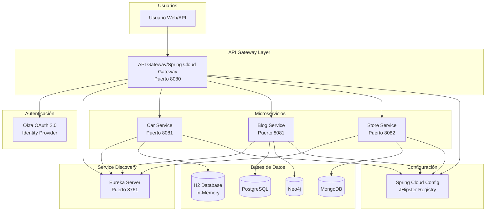

# Documento AS-IS: 2WQ-000 - Demo de AI

> **Propósito del documento**: Este documento captura el estado actual del proyecto tal como existe hoy. Sirve como punto de referencia para comprender lo que tenemos antes de planificar cualquier migración o cambio.

---

## 1. Descripción

### 1.1 Resumen del proyecto
**Código de proyecto**: 2WQ-000

**Nombre del proyecto**: Demo de AI (Java Microservices with Spring Boot & Spring Cloud)

**Descripción del proyecto**:
Este proyecto es una colección de ejemplos demostrativos que ilustran cómo construir arquitecturas de microservicios en Java utilizando Spring Boot y Spring Cloud. El repositorio contiene cinco ejemplos diferentes que muestran distintos patrones y tecnologías para implementar microservicios modernos y escalables.

Las tecnologías principales incluyen:
- Java 11
- Spring Boot 2.2.5+
- Spring Cloud (Hoxton.SR10 y posteriores)
- JHipster (versiones 6.x y 7.x)
- Netflix Eureka (Service Discovery)
- Spring Cloud Gateway (API Gateway)
- Spring Cloud Config (Configuración centralizada)
- OAuth 2.0 con Okta (Autenticación y autorización)
- Bases de datos: PostgreSQL, MongoDB, Neo4j, H2
- Kubernetes (para despliegues en la nube)

### 1.2 Funcionalidades principales

El proyecto proporciona cinco ejemplos independientes que demuestran diferentes arquitecturas y patrones:

1. **Arquitectura básica de microservicios**: Implementación simple con Spring Boot, Spring Cloud, Eureka Server y Zuul para enrutamiento de API
2. **Microservicios con JHipster y Spring Cloud Config**: Arquitectura generada con JHipster que utiliza configuración centralizada
3. **Gateway reactivo con Spring Cloud Gateway**: Implementación de microservicios reactivos usando Spring WebFlux y programación reactiva
4. **Microservicios reactivos con JHipster**: Arquitectura completa generada por JHipster con soporte reactivo y Spring Cloud Gateway
5. **Despliegue en Kubernetes**: Ejemplo de JHipster 7 que muestra cómo desplegar microservicios en Kubernetes con Google Cloud y gestión de secretos

Cada ejemplo incluye:
- Servicios de descubrimiento (Eureka)
- API Gateway para enrutamiento
- Microservicios de negocio (blog, store, car-service)
- Autenticación OAuth 2.0 integrada
- Configuración para múltiples entornos

### 1.3 Usuarios

| Usuario o sistema | Descripción del uso general que el usuario da al sistema o las interacciones importantes de este |
|------------|---------|
| Desarrolladores | Utilizan los ejemplos como referencia y plantilla para construir arquitecturas de microservicios con Spring Boot y Spring Cloud |
| Equipos de arquitectura | Estudian los patrones de diseño y las mejores prácticas implementadas en los ejemplos |
| Servicios externos (Okta) | Sistema de autenticación OAuth 2.0 que proporciona servicios de Identity Provider (IdP) para todos los microservicios |
| Eureka Server | Sistema de descubrimiento de servicios que permite el registro y localización dinámica de microservicios |

---

## 2. Arquitectura técnica

### 2.1 Diseño de la solución

El proyecto contiene cinco implementaciones diferentes, cada una con sus propios componentes:

| Componente | Descripción | 
|------------|---------|
| **spring-boot+cloud/discovery-service** | Servidor Eureka para descubrimiento de servicios. Java 11, Spring Boot 2.2.5, Netflix Eureka Server. Puerto 8761. Registra y descubre microservicios en la arquitectura. |
| **spring-boot+cloud/api-gateway** | Gateway API con Zuul. Java 11, Spring Boot 2.2.5, Spring Cloud Zuul. Puerto 8080. Enruta peticiones a microservicios, integra OAuth 2.0 con Okta para autenticación. |
| **spring-boot+cloud/car-service** | Microservicio de gestión de vehículos. Java 11, Spring Boot 2.2.5, Spring Data JPA, base de datos H2 en memoria. Puerto 8081. Expone API REST para operaciones CRUD de vehículos, usa Okta para seguridad. |
| **spring-cloud-gateway/discovery-service** | Servidor Eureka para descubrimiento. Similar al ejemplo anterior pero optimizado para Spring Cloud Gateway. Puerto 8761. |
| **spring-cloud-gateway/api-gateway** | Gateway API reactivo con Spring Cloud Gateway. Java 11, Spring Boot 2.2.5, Spring WebFlux. Puerto 8080. Enrutamiento reactivo con programación no bloqueante, OAuth 2.0 con Okta. |
| **spring-cloud-gateway/car-service** | Microservicio reactivo de vehículos. Java 11, Spring Boot 2.2.5, Spring WebFlux. Puerto 8081. API REST reactiva con H2. |
| **jhipster/gateway** | Gateway JHipster con Spring Boot. Java 11, JHipster 6.x, Spring Cloud Config, PostgreSQL para producción. Puerto 8080. Gateway con UI Angular, OAuth 2.0, configuración centralizada. |
| **jhipster/blog** | Microservicio de blog generado con JHipster. Java 11, PostgreSQL. Puerto 8081. Gestión de blogs, posts y tags. Entidades: Blog, Post, Tag. |
| **jhipster/store** | Microservicio de tienda generado con JHipster. Java 11, MongoDB. Puerto 8082. Gestión de productos. Entidad: Product. Sin caché Hibernate. |
| **reactive-jhipster/gateway** | Gateway JHipster reactivo. Java 11, JHipster 7.x, Spring WebFlux, Gradle. Puerto 8080. Gateway reactivo con PostgreSQL, UI reactiva, OAuth 2.0. |
| **reactive-jhipster/blog** | Microservicio reactivo de blog. Java 11, Spring WebFlux, Neo4j como base de datos. Puerto 8081. Implementación reactiva completa con base de datos de grafos. |
| **reactive-jhipster/store** | Microservicio reactivo de tienda. Java 11, Spring WebFlux, MongoDB. Puerto 8082. Microservicio reactivo con MongoDB para almacenamiento de productos. |
| **jhipster-k8s/gateway** | Gateway JHipster para Kubernetes. Java 11, JHipster 7.x, Gradle. Configurado para despliegue en Kubernetes con soporte para Google Cloud. |
| **jhipster-k8s/blog** | Microservicio blog para K8s. Java 11, Neo4j. Configurado para contenedores y orquestación con Kubernetes. |
| **jhipster-k8s/store** | Microservicio store para K8s. Java 11, MongoDB. Incluye configuración de clustering de base de datos para Kubernetes. |

**Diagrama de arquitectura**:

### 2.2 Requisitos principales

**DATOS**
| Tipo de requerimiento | Descripción del requerimiento | 
|------------|---------|
| Clasificación de datos | Non-Sensitive - Los datos utilizados en estos ejemplos son demostrativos (información de vehículos, blogs, productos) sin contenido confidencial real. Los ejemplos utilizan datos de prueba para ilustrar funcionalidades. | 
| Tiempo de datos | Temporal - Los datos son para fines de demostración y pruebas. Las bases de datos H2 se ejecutan en memoria y se pierden al reiniciar. Las implementaciones con PostgreSQL y MongoDB son para entornos de desarrollo y demostración. | 
| Protección de datos | Los datos están protegidos mediante autenticación OAuth 2.0 con Okta. Las comunicaciones entre servicios utilizan HTTPS. Los secretos (client ID, client secret) se configuran en archivos de propiedades que deben protegerse. No hay cifrado adicional de datos en reposo ya que son datos de demostración. | 

**SEGURIDAD**
| Tipo de requerimiento | Descripción del requerimiento | 
|------------|---------|
| Autenticación | Tipo de credenciales: OAuth 2.0 / OpenID Connect (OIDC) con Okta como proveedor de identidad (IdP). Todos los microservicios y gateways están configurados para usar Okta como IdP externo. Protocolo: OAuth 2.0 con flujos Authorization Code y Refresh Token. Las credenciales incluyen client-id y client-secret proporcionados por Okta. Spring Security gestiona la autenticación en cada servicio. | 
| Autorización | Control de acceso basado en roles (RBAC) utilizando grupos de Okta. Roles predefinidos: ROLE_ADMIN y ROLE_USER. Los grupos se incluyen como claims en el token ID de Okta. Spring Security maneja la autorización a nivel de endpoints utilizando anotaciones de seguridad. | 
| Conectividad | Red corporativa - No: Los servicios están diseñados para ejecutarse localmente o en entornos cloud. Internet - Entrada/Salida: Los servicios requieren acceso saliente a Internet para conectar con Okta (autenticación) y potencialmente para acceso entrante si se exponen públicamente. Las comunicaciones internas entre microservicios utilizan HTTP/HTTPS dentro de la red privada o cluster. |

**OPERACIÓN / MONITORIZACIÓN**
| Tipo de requerimiento | Descripción del requerimiento | 
|------------|---------|
| Estrategia de monitorización | Spring Boot Actuator está habilitado en los microservicios para exponer endpoints de health checks y métricas. Los ejemplos incluyen integración opcional con Zipkin para distributed tracing en la configuración de Docker Compose. No hay información sobre paneles de Grafana en los ejemplos. | 
| SLA | No hay información suficiente sobre este dato - Los ejemplos son demostrativos y no definen SLAs específicos. | 
| Disaster Recovery | No hay información suficiente sobre este dato - No se incluye estrategia de DR en los ejemplos de demostración. |

**DEVOPS**
| Tipo de requerimiento | Descripción del requerimiento | Detalle | 
|------------|---------|---|
| Petición On-Boarding (SIAYA) | No hay información suficiente sobre este dato | Los ejemplos no referencia ningún sistema de tickets corporativo. | 
| Componente | spring-boot+cloud | https://github.com/oktadev/java-microservices-examples (referenciado en README) | 
| Componente | jhipster | https://github.com/oktadev/java-microservices-examples (referenciado en README) | 
| Componente | reactive-jhipster | https://github.com/oktadev/java-microservices-examples (referenciado en README) | 
| Componente | spring-cloud-gateway | https://github.com/oktadev/java-microservices-examples (referenciado en README) | 
| Componente | jhipster-k8s | https://github.com/oktadev/java-microservices-examples (referenciado en README) | 
| Uso de Tests Automatizados | Los proyectos incluyen dependencias de Spring Boot Test, JUnit Jupiter y AssertJ para testing unitario e integración. Cada microservicio tiene su estructura de tests bajo src/test. No hay información sobre integración con plataforma de CI/CD corporativa. | Frameworks: JUnit 5, AssertJ, Spring Boot Test | 
| No Code (Kafka / Couch / Alertas) | No hay información suficiente sobre este dato | Los ejemplos no utilizan Kafka, CouchDB ni sistemas de alertas No-Code. | 
| Entornos / Plataformas de despliegue | Los ejemplos están configurados para: 1) Ejecución local con Maven/Gradle, 2) Contenedores Docker con Docker Compose, 3) Kubernetes (ejemplo jhipster-k8s con deployment en Google Cloud). Perfiles de Spring: dev, prod, oauth2. | Local, Docker, Kubernetes (Google Cloud) |

**REQUISITOS TECNICOS**
| Tipo de requerimiento | Descripción del requerimiento | 
|------------|---------|
| Arquitectura | Arquitectura de microservicios con patrón API Gateway, Service Discovery (Eureka), y configuración centralizada (Spring Cloud Config). Comunicación síncrona REST entre servicios. Dos variantes: arquitectura tradicional (bloqueante) y arquitectura reactiva (no bloqueante) con Spring WebFlux. |
| Lenguaje y librerías | Java 11. Spring Boot 2.2.5+. Spring Cloud Hoxton.SR10+. Librerías principales: Spring Data JPA, Spring Data REST, Spring WebFlux (reactivo), Netflix Eureka Client/Server, Okta Spring Boot Starter 1.4.0, Lombok, Jackson, HikariCP, Swagger/Springfox, JHipster Framework (para ejemplos JHipster). |  
| Configuración | Configuración externalizada usando Spring Cloud Config Server (JHipster Registry). Archivos application.yml para configuración por entorno (dev, prod). Propiedades de Okta OAuth2 (issuer, client-id, client-secret) configuradas por aplicación. Configuración de bases de datos por perfil de Spring. |
| Despliegue | Maven (mvnw) para build y ejecución local. Docker y Docker Compose para contenedorización. Kubernetes para orquestación en cloud (ejemplo jhipster-k8s). JHipster proporciona generadores para deployments (k8s sub-generator). Google Jib para construcción de imágenes Docker sin Docker daemon. | 

### 2.3 Servicios y Jobs

No hay información suficiente sobre despliegues en entornos específicos (PRO/NFT/UAT) con namespaces, réplicas y quotas. Los ejemplos son demostrativos y están configurados para ejecución local, Docker local o Kubernetes genérico sin especificar entornos corporativos concretos.

**UBICACIÓN DE COMPONENTES**
| Entorno | Namespace | Componentes | Tipo | Réplicas  | Talla  | Quota Máxima Namespace  |  
|------------|---------|---|---|---|---|---|
| Local/Demo | N/A | discovery-service, api-gateway, car-service | Deployment | 1 | N/A | N/A | 
| Local/Demo | N/A | gateway, blog, store (JHipster) | Deployment | 1 | N/A | N/A |
| Kubernetes | demo (configurable) | gateway, blog, store (jhipster-k8s) | Deployment | Configurable | Configurable | No especificada |

### 2.4 Matriz de comunicación

**MATRIZ DE COMUNICACIONES CON SISTEMAS EXTERNOS**
| Origen | Destino | FQDN/IP Destino | Protocolo L7 | Puerto  | Autenticación  | Propósito  | 
|------------|---------|---|---|---|---|--|
| api-gateway, car-service (spring-boot+cloud) | Okta IdP | https://{yourOktaDomain}/oauth2/default | HTTPS | 443 | OAuth 2.0 Client Credentials (client-id, client-secret) | Autenticación y autorización de usuarios mediante OAuth 2.0 / OIDC. Validación de tokens JWT. |
| api-gateway (spring-cloud-gateway) | Okta IdP | https://{yourOktaDomain}/oauth2/default | HTTPS | 443 | OAuth 2.0 Client Credentials | Autenticación OAuth 2.0 para gateway reactivo. |
| car-service (spring-cloud-gateway) | Okta IdP | https://{yourOktaDomain}/oauth2/default | HTTPS | 443 | OAuth 2.0 Client Credentials | Autenticación OAuth 2.0 para microservicio reactivo. |
| gateway (jhipster, reactive-jhipster, jhipster-k8s) | Okta IdP | https://{yourOktaDomain}/oauth2/default | HTTPS | 443 | OAuth 2.0 Client Credentials | Autenticación centralizada para aplicaciones JHipster. Inclusión de claims de grupos (ROLE_ADMIN, ROLE_USER). |
| blog, store (todos los ejemplos JHipster) | Okta IdP | https://{yourOktaDomain}/oauth2/default | HTTPS | 443 | OAuth 2.0 Client Credentials | Autenticación OAuth 2.0 para microservicios. |
| api-gateway | Eureka Server | http://localhost:8761/eureka | HTTP | 8761 | Sin autenticación (demo) | Registro y descubrimiento de microservicios disponibles. |
| car-service | Eureka Server | http://localhost:8761/eureka | HTTP | 8761 | Sin autenticación (demo) | Registro del microservicio en el discovery server. |
| gateway, blog, store (JHipster) | JHipster Registry | http://localhost:8761 | HTTP | 8761 | OAuth 2.0 (configurado con oauth2 profile) | Descubrimiento de servicios y servidor de configuración centralizada (Spring Cloud Config). |
| api-gateway | car-service | http://car-service/ (resuelto via Eureka) | HTTP | 8081 | OAuth 2.0 Bearer Token | Enrutamiento de peticiones del gateway al microservicio de vehículos. |
| gateway (JHipster) | blog | http://blog/ (resuelto via Eureka) | HTTP | 8081 | OAuth 2.0 Bearer Token | Enrutamiento de peticiones del gateway JHipster al microservicio blog. |
| gateway (JHipster) | store | http://store/ (resuelto via Eureka) | HTTP | 8082 | OAuth 2.0 Bearer Token | Enrutamiento de peticiones del gateway JHipster al microservicio store. |

### 2.5 APIs y consumidores

| WSO API Name | Contexto | Versiones desplegadas | Gateways | Microservicio  | Endpoint  | 
|------------|---------|---|---|---|---|
| No hay información suficiente | Los ejemplos exponen APIs REST pero no están registrados en un API Management como WSO2. | N/A | N/A | N/A | N/A |

Las APIs expuestas por los microservicios incluyen:

**spring-boot+cloud y spring-cloud-gateway:**
- **car-service**: Endpoints REST para gestión de vehículos (CRUD operations) accesibles a través de `/cars` en el API Gateway (puerto 8080)
- **api-gateway**: Enruta peticiones a microservicios registrados en Eureka

**Ejemplos JHipster (jhipster, reactive-jhipster, jhipster-k8s):**
- **blog microservice**: APIs para entidades Blog, Post, Tag accesibles vía gateway
- **store microservice**: APIs para entidad Product accesibles vía gateway
- **gateway**: Expone APIs consolidadas en puerto 8080, incluye UI web (Angular)

**Detalle de los consumidores**

| WSO API Name | App WSO - Subscriptores | Llamadas últimos 30 días | Notas | 
|------------|---------|---|---|
| No hay información suficiente | Las APIs están diseñadas para ser consumidas por clientes web (navegadores) o herramientas de testing (Postman, curl). No hay información sobre consumidores específicos de producción. | N/A | Los ejemplos son demostrativos para propósitos de aprendizaje y desarrollo. |

### 2.6 Comunicaciones asíncronas

No hay información suficiente sobre comunicaciones asíncronas. Los ejemplos demostrativos utilizan comunicación síncrona REST entre microservicios. No se implementa Kafka, RabbitMQ, ActiveMQ ni otras plataformas de mensajería asíncrona en estos ejemplos.

**TÓPICOS DE KAFKA CONSUMIDORES**
| Servicio | Nombre | 
|------------|---------|
| No aplica | No se utiliza Kafka en estos ejemplos | 

**TÓPICOS DE KAFKA PRODUCTORES**
| Servicio | Nombre | 
|------------|---------|
| No aplica | No se utiliza Kafka en estos ejemplos | 

### 2.7 Bases de datos

**BASE DE DATOS**
| Componente | Base de Datos | URL/Dirección completa | Tipo       | Entorno(s) | Propósito | Tablas/Colecciones | Notas (TTL e índices) |
|-------------|---------------|---------------|------------|------------|-----------|---------------------|--------|
| car-service (spring-boot+cloud) | H2 | jdbc:h2:mem:testdb | In-Memory Relacional | dev, local | Almacenamiento temporal de datos de vehículos para demostración | Car (id, name, cool) | Base de datos en memoria, datos se pierden al reiniciar. Sin TTL. |
| car-service (spring-cloud-gateway) | H2 | jdbc:h2:mem:testdb | In-Memory Relacional | dev, local | Almacenamiento temporal de datos de vehículos para ejemplo reactivo | Car (id, name, cool) | Base de datos en memoria. Sin TTL. |
| gateway (jhipster) | PostgreSQL | jdbc:postgresql://localhost:5432/gateway | Relacional | dev, prod | Almacenamiento de datos del gateway JHipster (usuarios, configuración) | Tablas JHipster estándar (jhi_user, jhi_authority, etc.) | Ejecutado en Docker en desarrollo. Sin información de TTL. |
| blog (jhipster) | PostgreSQL | jdbc:postgresql://localhost:5432/blog | Relacional | dev, prod | Almacenamiento de entidades Blog, Post, Tag | blog, post, tag, rel_post__tag | Ejecutado en Docker. Sin información de TTL. |
| store (jhipster) | MongoDB | mongodb://localhost:27017/store | NoSQL (Documento) | dev, prod | Almacenamiento de entidades Product | product | Base de datos NoSQL sin caché Hibernate. Ejecutado en Docker. Sin información de TTL. |
| gateway (reactive-jhipster) | PostgreSQL | jdbc:postgresql://localhost:5432/gateway | Relacional | dev, prod | Almacenamiento de datos del gateway JHipster reactivo | Tablas JHipster estándar | Ejecutado en Docker con soporte reactivo R2DBC. Sin TTL. |
| blog (reactive-jhipster) | Neo4j | bolt://localhost:7687 | Grafos | dev, prod | Almacenamiento de entidades Blog, Post, Tag como grafos | Nodos: Blog, Post, Tag con relaciones | Base de datos de grafos para demostrar arquitectura reactiva. Sin TTL. |
| store (reactive-jhipster) | MongoDB | mongodb://localhost:27017/store | NoSQL (Documento) | dev, prod | Almacenamiento reactivo de productos | product | MongoDB con driver reactivo. Sin TTL. |
| blog (jhipster-k8s) | Neo4j | bolt://blog-neo4j:7687 | Grafos | kubernetes | Almacenamiento de entidades Blog para K8s | Nodos: Blog, Post, Tag | Configurado para despliegue en Kubernetes. Sin TTL. |
| store (jhipster-k8s) | MongoDB | mongodb://store-mongodb:27017/store | NoSQL (Documento) | kubernetes | Almacenamiento de productos para K8s con clustering | product | Soporte para clustering de MongoDB en Kubernetes. Sin TTL. |

---

## 3. Información adicional

### Desafíos o problemas actuales

- **Dependencias externas**: Los ejemplos requieren configuración manual de una cuenta Okta y creación de aplicaciones OIDC. Esto puede ser una barrera para desarrolladores que quieren probar rápidamente los ejemplos.

- **Configuración de seguridad**: Los secretos OAuth 2.0 (client-id, client-secret, issuer) se configuran en archivos de propiedades en texto plano. En un entorno de producción real, estos deberían gestionarse con soluciones de gestión de secretos (Azure Key Vault, Kubernetes Secrets, etc.).

- **Versiones de dependencias**: Algunos ejemplos utilizan versiones de Spring Boot (2.2.5) y Spring Cloud (Hoxton.SR10) que pueden no ser las más recientes. Para migración a producción se recomienda actualizar a versiones LTS más recientes.

- **Bases de datos en memoria**: Los ejemplos básicos (spring-boot+cloud, spring-cloud-gateway) utilizan H2 en memoria, lo que significa que todos los datos se pierden al reiniciar. No apto para entornos persistentes.

- **Sin monitorización avanzada**: Aunque se incluye Spring Boot Actuator y menciona Zipkin, no hay implementación completa de observabilidad con métricas, logs centralizados (ELK/EFK) o APM.

### Notas importantes

- **Propósito educativo**: Este proyecto está diseñado principalmente como material educativo y de demostración. No es una aplicación de producción y requeriría endurecimiento significativo de seguridad, operaciones y arquitectura para uso productivo.

- **Documentación rica**: El proyecto incluye documentación detallada en formato AsciiDoc (demo.adoc) para cada ejemplo, con instrucciones paso a paso para configuración y ejecución.

- **Blog posts asociados**: Los ejemplos están vinculados a artículos del blog de Okta Developer que proporcionan contexto adicional y tutoriales:
  - Java Microservices with Spring Boot and Spring Cloud
  - Java Microservices with Spring Cloud Config and JHipster
  - Secure Reactive Microservices with Spring Cloud Gateway
  - Reactive Java Microservices with Spring Boot and JHipster
  - Kubernetes to the Cloud with Spring Boot and JHipster

- **Licencia**: El proyecto está bajo licencia Apache 2.0, permitiendo uso libre con atribución.

- **Origen**: El repositorio original está alojado en GitHub bajo oktadev/java-microservices-examples (según referencias en README).

- **Generación automática con JHipster**: Los ejemplos que utilizan JHipster (jhipster, reactive-jhipster, jhipster-k8s) fueron generados usando el generador de código JHipster, que proporciona scaffolding completo para aplicaciones empresariales con mejores prácticas incorporadas.
