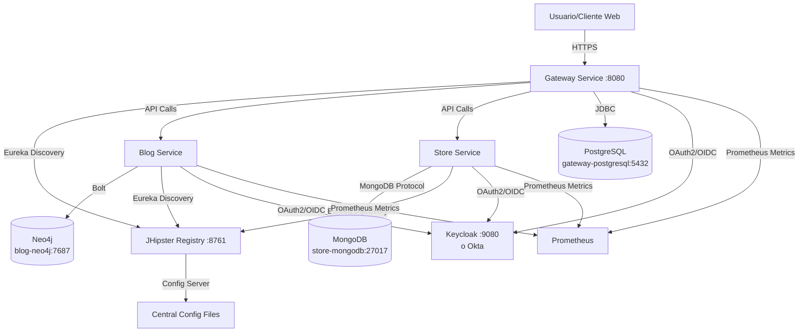

# Documento AS-IS: 2WQ-000 - Demo Carlos

> **Propósito del documento**: Este documento captura el estado actual del proyecto tal como existe hoy. Sirve como punto de referencia para comprender lo que tenemos antes de planificar cualquier migración o cambio.

---

## 1. Descripción

### 1.1 Resumen del proyecto
**Código de proyecto**: 2WQ-000

**Nombre del proyecto**: Demo Carlos

**Descripción del proyecto**:
Este proyecto es una aplicación de demostración de microservicios basada en JHipster 7 que demuestra cómo construir y desplegar aplicaciones modernas utilizando tecnologías reactivas de Java. El sistema está compuesto por tres servicios principales: un gateway que actúa como punto de entrada único, un servicio de blog para gestionar contenido editorial (blogs, posts y etiquetas), y un servicio de tienda para gestionar productos. La arquitectura está diseñada para desplegarse en Kubernetes (tanto en Minikube localmente como en Google Cloud Platform - GKE).

**Tecnologías principales**:
- Java 11
- Spring Boot 2.4.4
- Spring Cloud Gateway (servicio Gateway)
- JHipster 7.0.1
- Gradle
- Docker y Kubernetes
- PostgreSQL (Gateway)
- Neo4j (Blog)
- MongoDB (Store)
- Keycloak/Okta OIDC para autenticación
- Eureka para service discovery
- JHipster Registry para configuración centralizada

### 1.2 Funcionalidades principales

**Gestión de Productos (Store Service)**:
- Crear, consultar, actualizar y eliminar productos
- Cada producto incluye título, precio e imagen
- Almacenamiento en base de datos MongoDB
- Paginación de resultados

**Gestión de Contenido Editorial (Blog Service)**:
- Crear y gestionar blogs con nombre y handle único
- Crear posts asociados a blogs con título, contenido y fecha
- Organizar contenido mediante tags/etiquetas
- Relación entre blogs y usuarios
- Almacenamiento en base de datos de grafos Neo4j

**Gateway y Enrutamiento**:
- Punto de entrada único para todos los servicios
- Enrutamiento inteligente de peticiones a microservicios backend
- Integración con JHipster Registry para descubrimiento de servicios
- Interfaz de usuario web para interactuar con todos los servicios

**Autenticación y Autorización**:
- Autenticación centralizada mediante OAuth2/OIDC (Okta o Keycloak)
- Gestión de roles (ROLE_ADMIN, ROLE_USER)
- Single Sign-On (SSO) entre todos los servicios

**Monitorización y Observabilidad**:
- Métricas exportadas a Prometheus
- Health checks para cada servicio
- Endpoints de gestión actuator
- Integración con JHipster Console

### 1.3 Usuarios

| Usuario o sistema | Descripción del uso general que el usuario da al sistema o las interacciones importantes de este |
|------------|---------|
| Usuarios finales con autenticación | Usuarios autenticados que pueden gestionar productos, crear y visualizar blogs, posts y tags. Acceden a través del gateway web. |
| Administradores | Usuarios con rol ROLE_ADMIN que tienen acceso completo a todas las funcionalidades y endpoints de gestión. |
| JHipster Registry | Sistema de configuración centralizada y descubrimiento de servicios que interactúa con todos los microservicios. |
| Prometheus | Sistema de monitorización que consume métricas expuestas por los servicios. |
| Kubernetes | Plataforma de orquestación que gestiona el ciclo de vida de los contenedores y servicios. |

---

## 2. Arquitectura técnica

### 2.1 Diseño de la solución

| Componente | Descripción | 
|------------|---------|
| Gateway | Servicio de puerta de enlace construido con Java 11, Spring Boot 2.4.4 y Spring Cloud Gateway. Proporciona el punto de entrada único para la aplicación, enrutamiento de peticiones a microservicios backend, autenticación OAuth2/OIDC, interfaz de usuario web construida con Angular. Expone APIs REST, se conecta a PostgreSQL para persistencia, se registra en Eureka para service discovery. Incluye métricas Prometheus, health checks y testing con JUnit. |
| Blog | Microservicio construido con Java 11, Spring Boot 2.4.4. Gestiona blogs, posts y tags con entidades: Blog (name, handle), Post (title, content, date), Tag (name). Utiliza Neo4j como base de datos de grafos. Expone APIs REST, autenticación OAuth2, se registra en Eureka, métricas Prometheus, health checks y testing. |
| Store | Microservicio construido con Java 11, Spring Boot 2.4.4. Gestiona productos con entidad Product (title, price, image). Utiliza MongoDB como base de datos NoSQL. Expone APIs REST, autenticación OAuth2, se registra en Eureka, métricas Prometheus, paginación de resultados, health checks y testing. |
| JHipster Registry | Servicio de configuración centralizada y descubrimiento de servicios basado en Eureka. Versión v6.7.1. Almacena configuraciones en el sistema de archivos (perfil native), proporciona dashboard de administración, autenticación OAuth2, gestiona el registro de microservicios. |
| Gateway PostgreSQL | Base de datos relacional PostgreSQL 13.2 utilizada por el servicio Gateway para almacenar datos de usuarios y configuración. |
| Blog Neo4j | Base de datos de grafos Neo4j 4.2.4 utilizada por el servicio Blog para almacenar blogs, posts, tags y sus relaciones. |
| Store MongoDB | Base de datos NoSQL MongoDB 4.4.4 utilizada por el servicio Store para almacenar productos. |
| Keycloak | Servidor de autenticación e identidad (opcional, alternativa a Okta). Versión configurada para proporcionar autenticación OAuth2/OIDC, gestión de usuarios y roles, realm jhipster configurado. |

**Diagrama de arquitectura**:

### 2.2 Requisitos principales

 

**DATOS**
| Tipo de requerimiento | Descripción del requerimiento | 
|------------|---------|
| Clasificación de datos | Non-Sensitive. Los datos gestionados son de demostración (productos de ejemplo, blogs de prueba) y no contienen información confidencial o de producción. |
| Tiempo de datos | Temporal. Los datos pueden eliminarse ya que se trata de un entorno de demostración y laboratorio. |
| Protección de datos | Los datos están protegidos mediante autenticación OAuth2/OIDC. Las comunicaciones entre servicios utilizan HTTP dentro del clúster de Kubernetes. Las credenciales de base de datos se gestionan mediante Kubernetes Secrets. Los tokens JWT se utilizan para la autenticación entre servicios. |

 
 

**SEGURIDAD**
| Tipo de requerimiento | Descripción del requerimiento | 
|------------|---------|
| Autenticación | Fuente: Usuarios externos mediante Okta o Keycloak. Proveedor de Identidad (IdP): Okta (OAuth2) o Keycloak (OAuth2/OIDC). Tipo de credenciales: OAuth2/OIDC con tokens JWT. Protocolos: OAuth2, OpenID Connect (OIDC). Servicios de tokens: Okta o Keycloak configurado con realm jhipster. Roles gestionados: ROLE_ADMIN, ROLE_USER. | 
| Autorización | La autorización se gestiona mediante roles de Spring Security (ROLE_ADMIN, ROLE_USER). Los endpoints de gestión requieren el rol ROLE_ADMIN. Las operaciones CRUD en entidades están protegidas por autenticación. El contexto de seguridad se comparte entre servicios mediante tokens JWT. | 
| Conectividad | Red corporativa - No: No hay conexión directa con redes locales. Internet - Entrada: El Gateway publica servicios en Internet (LoadBalancer en Kubernetes). Internet - Salida: Los servicios requieren conexiones salientes a Okta/Keycloak para validación de tokens. Comunicación interna: Los microservicios se comunican dentro del clúster de Kubernetes mediante nombres de servicio DNS. |

 
 

**OPERACIÓN / MONITORIZACIÓN**
| Tipo de requerimiento | Descripción del requerimiento | 
|------------|---------|
| Estrategia de monitorización | Herramientas: Prometheus para métricas, Spring Boot Actuator para health checks. KPIs: Métricas de aplicación JHipster (jhimetrics), métricas de JVM, métricas de base de datos. |
| Health Checks | Cada servicio expone endpoints: /management/health (estado general), /management/health/liveness (liveness probe), /management/health/readiness (readiness probe). |
| Logs | Los logs se gestionan mediante configuración Logback. Los logs pueden ser centralizados mediante agregadores como ELK stack (no configurado por defecto). |
| SLA | No hay información suficiente sobre SLA definidos (proyecto de demostración). |
| Disaster Recovery | No hay estrategia de disaster recovery específica definida (proyecto de demostración). |

 
 

**DEVOPS**
| Tipo de requerimiento | Descripción del requerimiento | Detalle | 
|------------|---------|---|
| Petición On-Boarding (SIAYA) | No hay información suficiente sobre este dato | N/A | 
| Componente Gateway | gateway | Repositorio en Bitbucket: mcp/bitbucket/2WQ-000/jhipster-k8s/gateway | 
| Componente Blog | blog | Repositorio en Bitbucket: mcp/bitbucket/2WQ-000/jhipster-k8s/blog |
| Componente Store | store | Repositorio en Bitbucket: mcp/bitbucket/2WQ-000/jhipster-k8s/store |
| Uso de Tests Automatizados | Tests unitarios con JUnit 5, tests de integración con @IntegrationTest. Cada componente incluye tests para recursos REST, servicios y mappers. Comandos Gradle: test (unitarios), integrationTest (integración). | Cobertura con JaCoCo, análisis estático con Checkstyle |
| No Code (Kafka / Couch / Alertas) | No se utiliza Kafka, Couch ni alertas no-code en este proyecto | N/A | 
| Entornos / Plataformas de despliegue | Docker Compose (desarrollo local), Kubernetes/Minikube (desarrollo local), Google Kubernetes Engine - GKE (producción) | Soporte para despliegue con Jib, Skaffold para desarrollo, configuración de perfiles: dev, prod |

 
 

**REQUISITOS TECNICOS**
| Tipo de requerimiento | Descripción del requerimiento | 
|------------|---------|
| Arquitectura | Arquitectura de microservicios con API Gateway pattern, Service Discovery con Eureka, Configuración centralizada con Spring Cloud Config, Circuit Breaker con Hystrix/Resilience4j |
| Lenguaje y librerías | Java 11, Spring Boot 2.4.4, Spring Cloud, JHipster Dependencies 7.0.1, MapStruct 1.4.2.Final para mapeo de DTOs, Hibernate 5.4.29.Final, Reactive programming con Project Reactor (Gateway), Angular para frontend |
| Configuración | Configuración mediante archivos YAML (application.yml), Configuración por perfiles (dev, prod), Spring Cloud Config para configuración centralizada, Variables de entorno para secretos y configuración específica del entorno |
| Despliegue | Contenedorización con Docker, Orquestación con Kubernetes, Build de imágenes con Jib (sin necesidad de Docker daemon), Gestión de secretos con Kubernetes Secrets, Ingress para enrutamiento externo, Persistent Volume Claims para almacenamiento persistente de bases de datos |

### 2.3 Servicios y Jobs

**UBICACIÓN DE COMPONENTES**
| Entorno | Namespace | Componentes | Tipo | Réplicas  | Talla  | Quota Máxima Namespace  |  
|------------|---------|---|---|---|---|---|
| Kubernetes (Minikube/GKE) | demo | gateway | Deployment | 1 | -Xmx512m -Xms256m | No hay información suficiente |
| Kubernetes (Minikube/GKE) | demo | blog | Deployment | 1 | -Xmx512m -Xms256m | No hay información suficiente |
| Kubernetes (Minikube/GKE) | demo | store | Deployment | 1 | -Xmx512m -Xms256m | No hay información suficiente |
| Kubernetes (Minikube/GKE) | demo | jhipster-registry | Deployment | 1 | -Xmx512m -Xms256m | No hay información suficiente |
| Kubernetes (Minikube/GKE) | demo | gateway-postgresql | StatefulSet | 1 | No especificado | No hay información suficiente |
| Kubernetes (Minikube/GKE) | demo | blog-neo4j | StatefulSet | 1 | No especificado | No hay información suficiente |
| Kubernetes (Minikube/GKE) | demo | store-mongodb | StatefulSet | 1 | No especificado | No hay información suficiente |
| Docker Compose (local) | N/A | gateway | Container | 1 | -Xmx512m -Xms256m | N/A |
| Docker Compose (local) | N/A | blog | Container | 1 | -Xmx512m -Xms256m | N/A |
| Docker Compose (local) | N/A | store | Container | 1 | -Xmx512m -Xms256m | N/A |

### 2.4 Matriz de comunicación

**MATRIZ DE COMUNICACIONES CON SISTEMAS EXTERNOS**
| Origen | Destino | FQDN/IP Destino | Protocolo L7 | Puerto  | Autenticación  | Propósito  | 
|------------|---------|---|---|---|---|--|
| Gateway | JHipster Registry | jhipster-registry.demo.svc.cluster.local (K8s) / jhipster-registry (Docker) | HTTP | 8761 | Basic Auth (admin/password) | Registro de servicio y obtención de configuración |
| Blog | JHipster Registry | jhipster-registry.demo.svc.cluster.local (K8s) / jhipster-registry (Docker) | HTTP | 8761 | Basic Auth (admin/password) | Registro de servicio y obtención de configuración |
| Store | JHipster Registry | jhipster-registry.demo.svc.cluster.local (K8s) / jhipster-registry (Docker) | HTTP | 8761 | Basic Auth (admin/password) | Registro de servicio y obtención de configuración |
| Gateway | PostgreSQL | gateway-postgresql.demo.svc.cluster.local:5432 (K8s) / gateway-postgresql:5432 (Docker) | JDBC/PostgreSQL | 5432 | User/Password (trust mode) | Almacenamiento de datos del Gateway |
| Blog | Neo4j | blog-neo4j.demo.svc.cluster.local:7687 (K8s) / blog-neo4j:7687 (Docker) | Bolt | 7687 | No autenticación (NEO4J_AUTH=none) | Almacenamiento de datos de blogs, posts y tags |
| Store | MongoDB | store-mongodb.demo.svc.cluster.local:27017 (K8s) / store-mongodb:27017 (Docker) | MongoDB | 27017 | No autenticación | Almacenamiento de datos de productos |
| Gateway | Keycloak/Okta | Keycloak: keycloak:9080 (Docker) / Okta: https://{okta-domain} | HTTP/HTTPS | 9080 (Keycloak) / 443 (Okta) | OAuth2 Client Credentials | Validación de tokens OAuth2/OIDC |
| Blog | Keycloak/Okta | Keycloak: keycloak:9080 (Docker) / Okta: https://{okta-domain} | HTTP/HTTPS | 9080 (Keycloak) / 443 (Okta) | OAuth2 Client Credentials | Validación de tokens OAuth2/OIDC |
| Store | Keycloak/Okta | Keycloak: keycloak:9080 (Docker) / Okta: https://{okta-domain} | HTTP/HTTPS | 9080 (Keycloak) / 443 (Okta) | OAuth2 Client Credentials | Validación de tokens OAuth2/OIDC |
| Gateway | Prometheus | No hay información suficiente sobre el FQDN de Prometheus | HTTP | Variable | No autenticación | Exportación de métricas |
| Blog | Prometheus | No hay información suficiente sobre el FQDN de Prometheus | HTTP | Variable | No autenticación | Exportación de métricas |
| Store | Prometheus | No hay información suficiente sobre el FQDN de Prometheus | HTTP | Variable | No autenticación | Exportación de métricas |

### 2.5 APIs y consumidores

| WSO API Name | Contexto | Versiones desplegadas | Gateways | Microservicio  | Endpoint  | 
|------------|---------|---|---|---|---|
| No hay información suficiente | Gateway expone todas las APIs a través de enrutamiento | No especificado | LoadBalancer (K8s) / Puerto 8080 | gateway | http://gateway:8080 o http://gateway.demo.svc.cluster.local:8080 (K8s) |
| No hay información suficiente | Blog API | No especificado | Interno (solo accesible vía Gateway) | blog | Comunicación interna vía Eureka service discovery |
| No hay información suficiente | Store API | No especificado | Interno (solo accesible vía Gateway) | store | Comunicación interna vía Eureka service discovery |

**Endpoints disponibles por microservicio**:

**Gateway**:
- `/api/account` - Gestión de cuenta de usuario
- `/api/authenticate` - Autenticación
- `/api/admin/users` - Gestión de usuarios (admin)
- `/services/blog/**` - Proxy a Blog service
- `/services/store/**` - Proxy a Store service
- `/management/**` - Endpoints de gestión (health, metrics, etc.)

**Blog**:
- `/api/blogs` - CRUD de blogs
- `/api/posts` - CRUD de posts
- `/api/tags` - CRUD de tags
- `/management/**` - Endpoints de gestión

**Store**:
- `/api/products` - CRUD de productos (con paginación)
- `/management/**` - Endpoints de gestión

**Detalle de los consumidores**

No hay información suficiente sobre consumidores externos específicos. El Gateway actúa como único punto de entrada y consume internamente los servicios Blog y Store mediante service discovery de Eureka.

### 2.6 Comunicaciones asíncronas

**TÓPICOS DE KAFKA CONSUMIDORES**

No se utiliza Kafka en este proyecto.

**TÓPICOS DE KAFKA PRODUCTORES**

No se utiliza Kafka en este proyecto.

**Nota**: La comunicación entre servicios es síncrona mediante REST APIs. No hay comunicación asíncrona mediante mensajería en este proyecto.

### 2.7 Bases de datos

 
 

**BASE DE DATOS**
| Componente | Base de Datos | URL/Dirección completa | Tipo       | Entorno(s) | Propósito | Tablas/Colecciones | Notas (TTL e índices) |
|-------------|---------------|---------------|------------|------------|-----------|---------------------|--------|
| gateway | PostgreSQL | gateway-postgresql:5432 (Docker), gateway-postgresql.demo.svc.cluster.local:5432 (K8s) | Relacional | dev, prod | Almacenamiento de usuarios, autoridades y datos de sesión | jhi_user, jhi_authority, jhi_user_authority, DATABASECHANGELOG, DATABASECHANGELOGLOCK | Base de datos: gateway. Auth method: trust (sin password). Gestión de esquema con Liquibase. |
| blog | Neo4j | blog-neo4j:7687 (Docker), blog-neo4j.demo.svc.cluster.local:7687 (K8s) | Grafos | dev, prod | Almacenamiento de blogs, posts, tags y sus relaciones | Nodos: Blog, Post, Tag, User. Relaciones: Blog-[:HAS_USER]->User, Blog-[:HAS_POST]->Post, Post-[:HAS_TAG]->Tag | Protocolo Bolt. NEO4J_AUTH=none (sin autenticación). Versión Neo4j 4.2.4. |
| store | MongoDB | store-mongodb:27017 (Docker), store-mongodb.demo.svc.cluster.local:27017 (K8s) | NoSQL | dev, prod | Almacenamiento de productos | Colección: product. Campos: title, price, image (binary), id | Base de datos: store. Sin autenticación. Versión MongoDB 4.4.4. URI con parámetro waitQueueMultiple=1000. |

---

## 3. Información adicional

### Desafíos o problemas actuales

**Aspectos de demostración**:
- Este proyecto está configurado como una demostración educativa y no para uso en producción real
- La autenticación de bases de datos está deshabilitada o en modo "trust" por simplicidad
- No hay estrategia de backup/restore configurada para las bases de datos
- Las cuotas y límites de recursos en Kubernetes no están especificados

**Dependencias en desuso**:
- Hystrix está en modo mantenimiento y Spring recomienda migrar a Resilience4j
- Algunas versiones de dependencias pueden estar desactualizadas

**Configuración de seguridad**:
- En entorno de desarrollo, las contraseñas están hardcodeadas en archivos de configuración
- La comunicación entre servicios usa HTTP en lugar de HTTPS dentro del clúster

### Notas importantes

**Opciones de despliegue**:
El proyecto incluye múltiples variantes de implementación:
- `jhipster-k8s`: Versión con Kubernetes + JHipster 7 (analizada en este documento)
- `jhipster`: Versión básica con Docker Compose
- `reactive-jhipster`: Versión con programación reactiva completa
- `spring-boot+cloud`: Versión simplificada con Spring Boot y Spring Cloud
- `spring-cloud-gateway`: Versión con Spring Cloud Gateway

**Integración con Cloud**:
- El proyecto incluye scripts específicos para despliegue en Google Kubernetes Engine (GKE)
- Las imágenes Docker están configuradas para publicarse en Google Container Registry (gcr.io)
- Soporta Skaffold para desarrollo continuo en Kubernetes

**Herramientas de desarrollo**:
- Gradle como sistema de build
- Jib para construcción de imágenes Docker sin daemon
- Prettier para formateo de código
- Checkstyle para análisis estático
- SonarQube para análisis de calidad de código
- Husky para git hooks

**Perfil de ejecución**:
- Perfil `dev`: Para desarrollo local con configuración relajada
- Perfil `prod`: Para producción con optimizaciones y seguridad mejorada
- Perfil `oauth2`: Para habilitar autenticación OAuth2 en JHipster Registry

**Documentación de referencia**:
- El proyecto incluye referencias al blog original de Okta: https://developer.okta.com/blog/2021/06/01/kubernetes-spring-boot-jhipster
- Basado en el repositorio de ejemplos de microservicios de Java de Okta
